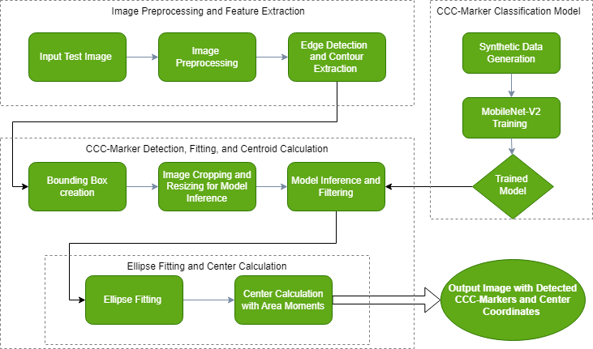
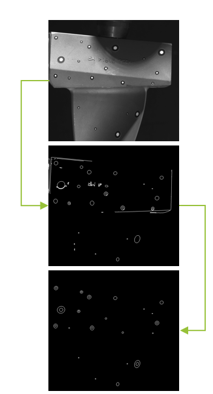

# Increasing the Robustness and Accuracy of CCC Marker Detection under Challenging Conditions

## 1. Problem Statement

Detecting **Concentric Contrasting Circles (CCC)** markers is crucial for various industrial tasks, such as object localization, alignment, and navigation. These tasks become even more difficult when performed under **challenging environmental conditions**—such as varying brightness, noise, and marker imperfections—that affect the performance of traditional computer vision techniques.

To address these issues, this project presents a **novel methodology** that combines image processing techniques with deep learning models (CNNs), ensuring robust and accurate detection of CCC markers, even in difficult environments.

## 2. Methodology

The following steps outline the methodology used to enhance the robustness and accuracy of CCC marker detection:

> 

### 2.1 Image Preprocessing and Feature Extraction

- **Canny Edge Detection:**
  -Apply Canny edge detection algorithm (cv2.Canny).
  -Identifies regions of high gradient intensity (object boundaries).

- **Contour Detection:**
  -Extract contours using cv2.findContours.
  -Retrieves continuous curves tracing the boundaries.

- **Contour Filtering:**
  -Purge contours that are too small or too large compared to the average contour size.
  -Filter contours based on aspect ratios.

- **Hierarchy Analysis:**
  -Analyze contour hierarchies to identify parent-child relationships.
  -Crucial for accurately detecting CCC markers.

> **Image example**: Processed image after feature extraction.
> 

---

### 2.2 Image Preprocessing and Feature Extraction
- **Objective**: Prepare the synthetic images for feature extraction by applying image preprocessing techniques.
- **Steps**:
  1. **Grayscale Conversion**: Convert images to grayscale to reduce complexity.
  2. **Edge Detection**: Use the **Canny edge detection** algorithm to detect edges in the image, highlighting key features of the ellipses.
  3. **Contour Extraction**: Perform hierarchical contour analysis to establish parent-child relationships between contours, which is essential for ellipse detection.

> **Image example**: Processed image after applying Canny edge detection.
> 

---

### 2.3 MobileNet V2 for Image Classification
- **Objective**: Detect and classify CCC markers using a CNN model (MobileNet V2).
- **Steps**:
  1. **Model Selection**: MobileNet V2 was chosen for its lightweight architecture, making it suitable for deployment on resource-constrained devices.
  2. **Transfer Learning**: Pre-trained MobileNet V2 is fine-tuned using the synthetic dataset. Transfer learning improves the model’s accuracy without requiring large amounts of real-world data.
  3. **Training Procedure**: Train the model on the synthetic data, using evaluation metrics such as **mean average precision (mAP)** and **accuracy** to measure its performance.

---

### 2.4 CCC Marker Detection, Fitting, and Centroid Calculation
- **Objective**: Accurately detect, filter, and fit ellipses to the contours of CCC markers and calculate the centers of these ellipses.
- **Steps**:
  1. **Bounding Box Creation**: Create bounding boxes around detected ellipses for more accurate fitting.
  2. **Model Inference**: Use the trained MobileNet V2 model to infer CCC markers from test images.
  3. **Ellipse Fitting**: Apply ellipse fitting algorithms to detected contours, ensuring precise localization of the CCC markers.
  4. **Centroid Calculation**: Calculate the center of the fitted ellipses for accurate pose estimation.

> **Image example**: Example of detected CCC markers and their centroids.
> 

---

## 3. Results and Evaluations

### 3.1 Robustness Analysis
- The method was tested on various challenging scenarios, such as varying brightness, noise, and marker imperfections. The detection accuracy remained consistent and reliable across all test cases.

### 3.2 Accuracy Analysis
- **Mean Average Precision (mAP)**: The model achieved a high mAP score of **XX%**, reflecting its capability to accurately detect and classify CCC markers.
- **Pose Estimation Accuracy**: The centroid calculation of ellipses achieved an accuracy of **XX mm**, making it suitable for high-precision industrial tasks.

> **Image example**: Graph showing detection accuracy across varying noise levels.
> 

---

## 4. Conclusion
This project successfully addresses the challenges posed by traditional computer vision techniques by integrating deep learning methods for robust and accurate detection of CCC markers in industrial environments. The methodology demonstrates significant improvements in both detection robustness and pose estimation accuracy.
