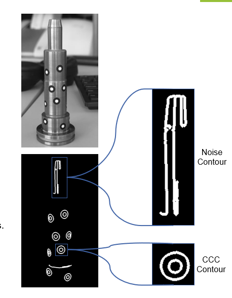
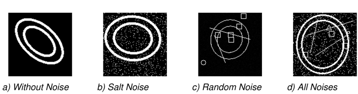
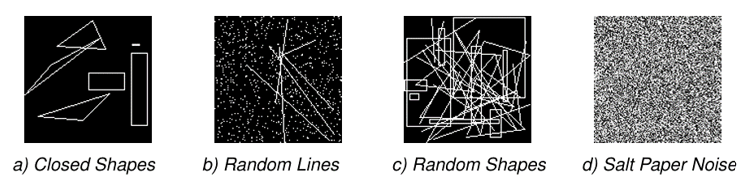
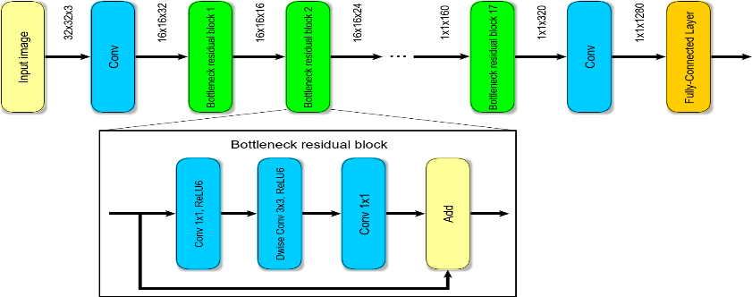

# Increasing the Robustness and Accuracy of CCC Marker Detection under Challenging Conditions

## 1. Problem Statement

Detecting **Concentric Contrasting Circles (CCC)** markers is crucial for various industrial tasks, such as object localization, alignment, and navigation. These tasks become even more difficult when performed under **challenging environmental conditions**—such as varying brightness, noise, and marker imperfections—that affect the performance of traditional computer vision techniques.

To address these issues, this project presents a **novel methodology** that combines image processing techniques with deep learning models (CNNs), ensuring robust and accurate detection of CCC markers, even in difficult environments.

## 2. Methodology

The following steps outline the methodology used to enhance the robustness and accuracy of CCC marker detection:

> 

### 2.1 Image Preprocessing and Feature Extraction

- **Canny Edge Detection:**
  - Apply Canny edge detection algorithm (cv2.Canny).
  - Identifies regions of high gradient intensity (object boundaries).

- **Contour Detection:**
  - Extract contours using cv2.findContours.
  - Retrieves continuous curves tracing the boundaries.

- **Contour Filtering:**
  - Purge contours that are too small or too large compared to the average contour size.
  - Filter contours based on aspect ratios.

- **Hierarchy Analysis:**
  - Analyze contour hierarchies to identify parent-child relationships.
  - Crucial for accurately detecting CCC markers.

> **Image example**: Processed image after feature extraction.
> 
> 

---

### 2.2 Synthetic Dataset Generation

- **Contour Classification:**
  - Filtering might still leave some noise contours.
  - A CNN model classifies contours as CCC markers or not.

> **Image example**: Contour image containing CCC-marker and noisy features.
> 

- **Why CNNs?:**
  - Merely using image processing does not achieve the desired robustness.
  - DNNs offer a more robust option to further refine features and improve accuracy.

- **Synthetic Dataset Generation:**
  - Generates synthetic dataset imitating CCC marker contours.
  - Saves time and computation by avoiding the preprocessing of thousands of real images(also hard to acquire).
  - Enables efficient model training and robust feature extraction.

> **Image example**: Samples of synthetic images generated for training - positive class.
> 

> **Image example**: Samples of synthetic images generated for training - negative class.
> 

---

### 2.3 MobileNet V2 for Image Classification
- **Architecture:**
  - Efficient: Depth-wise separable convolutions.
  - Resource-Constrained: Ideal for limited hardware.

- **Transfer Learning:**
  - Fine-Tuning: Pre-trained on ImageNet.
  - Issue: Initial overfitting; final fix: Unfreeze only top layers.

- **Training:**
  - Preprocessing: RGB, 128x128 pixels, normalization.
  - Model: Added global average pooling, dense layers.
  - Loss & Optimizer: Binary cross-entropy, Adam.

> MobileNet V2 Architecture.(https://doi.org/10.48550/arXiv.1801.04381)
> 

---

### 2.4 CCC Marker Detection, Fitting, and Centroid Calculation
- **Objective**: Accurately detect, filter, and fit ellipses to the contours of CCC markers and calculate the centers of these ellipses.
  
- We have all the dots now just need to connect everything.
- **Contour Detection:** cv2.findContours for edge image.
- **Bounding Box Calculation:** cv2.boundingRect for contours.
- **Image Cropping:** ROIs Cropped from bounding boxes.
- **Resizing:** 128x128 pixels with zero padding if needed.
- **Normalization:** Range [0, 1].
- **Batch Preparation:** Batch Size 32
- **Model Inference:** Threshold e.g., 0.5 for ellipse detection.
- **Filtering:** Retain boxes containing ellipses

> **Image example**: The steps mentioned above.
> 

---

## 3. Results and Evaluations

### 3.1 Robustness Analysis
- The method was tested on various challenging scenarios, such as varying brightness, noise, and marker imperfections. The detection accuracy remained consistent and reliable across all test cases.

### 3.2 Accuracy Analysis
- **Mean Average Precision (mAP)**: The model achieved a high mAP score of **XX%**, reflecting its capability to accurately detect and classify CCC markers.
- **Pose Estimation Accuracy**: The centroid calculation of ellipses achieved an accuracy of **XX mm**, making it suitable for high-precision industrial tasks.

> **Image example**: Graph showing detection accuracy across varying noise levels.
> 

---

## 4. Conclusion
This project successfully addresses the challenges posed by traditional computer vision techniques by integrating deep learning methods for robust and accurate detection of CCC markers in industrial environments. The methodology demonstrates significant improvements in both detection robustness and pose estimation accuracy.
